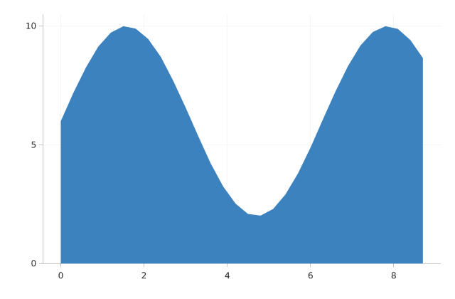

# Area

An area chart.



## Run it

```sh
mojo run -I . examples/area.mojo
```

(Or `pixi run example`, which runs every example in this directory in one go.)

## Source

```mojo
"""Demo: an area chart -- Mark.AREA, the same continuous (x, y) data
mark_line() draws, filled down to a zero baseline instead of stroked.

Supersampled 3x -- see examples/scatter.mojo's own docstring for why
every example here now renders this way (and why it isn't just "a
bigger canvas").

Run with:
    pixi run example
"""

from std.math import sin

from canvas_mojo.color import Color
from canvas_mojo.buffer import Canvas
from canvas_mojo.io.bmp import write_bmp
from canvas_mojo.io.png import write_png
from canvas_mojo.resize import downsample
from dataviz_mojo.plot import Plot, render
from dataviz_mojo.theme import Theme

comptime _SUPERSAMPLE = 3


def main() raises:
    var x = List[Float64]()
    var y = List[Float64]()
    for i in range(30):
        var t = Float64(i) * 0.3
        x.append(t)
        y.append(sin(t) * 4.0 + 6.0)

    var t = Theme(mark_color=Color(60, 130, 190), scale=Float64(_SUPERSAMPLE))
    var c = Canvas(640 * _SUPERSAMPLE, 420 * _SUPERSAMPLE, Color(255, 255, 255))
    var plot = Plot().mark_area().encode(x=x, y=y).theme(t)
    render(c, plot)
    var out = downsample(c, _SUPERSAMPLE)

    write_bmp(out, "examples/out_area.bmp")
    write_png(out, "examples/out_area.png")
    print("wrote examples/out_area.bmp and .png")
```

[View `area.mojo` on GitHub](https://github.com/randyzwitch/dataviz_mojo/blob/main/examples/area.mojo)
