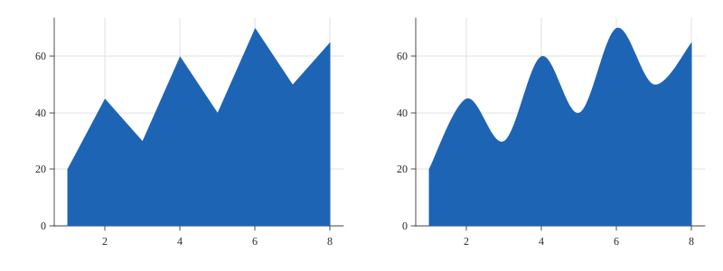

# Area Smoothing

Theme.line_smoothing on Mark.AREA.



## Run it

```sh
mojo run -I . examples/area_smoothing.mojo
```

(Or `pixi run example`, which runs every example in this directory in one go.)

## Source

```mojo
"""Demo: Theme.line_smoothing on Mark.AREA -- an area chart's own top
edge (through its data points) optionally curved through a Catmull-
Rom-derived spline, the exact same `_build_line_path` Mark.LINE's own
smoothing uses (see that field's own docstring). The bottom edge (down
to/along the zero baseline) always stays straight -- baseline is a
fixed reference, not data, with nothing to curve through. Default 0.0
(plain straight edges, byte-identical to every render from before
Mark.AREA had this); 1.0 is the full, standard Catmull-Rom curve.

The same eight-month dataset examples/line_smoothing.mojo uses,
rendered twice side by side via render_facets() -- smoothing=0.0 on
the left, smoothing=1.0 on the right.

Writes both a raster (.bmp, 3x supersampled) and a vector (.svg) file
from the same data -- see examples/donut.mojo's own docstring for why
every new example does this from here on.

Run with:
    pixi run example
"""

from canvas_mojo.color import Color
from canvas_mojo.buffer import Canvas
from canvas_mojo.io.bmp import write_bmp
from canvas_mojo.resize import downsample
from canvas_mojo.vector.svg import SvgCanvas, write_svg
from dataviz_mojo.plot import Plot, render_facets, render_facets_svg
from dataviz_mojo.theme import Theme

comptime _SUPERSAMPLE = 3


def main() raises:
    var months: List[Float64] = [1.0, 2.0, 3.0, 4.0, 5.0, 6.0, 7.0, 8.0]
    var values: List[Float64] = [20.0, 45.0, 30.0, 60.0, 40.0, 70.0, 50.0, 65.0]

    var s = Float64(_SUPERSAMPLE)
    var raster_plots = List[Plot]()
    raster_plots.append(Plot().mark_area().encode(x=months, y=values).theme(Theme(scale=s)))
    raster_plots.append(
        Plot().mark_area().encode(x=months, y=values).theme(Theme(line_smoothing=1.0, scale=s))
    )
    var c = Canvas(800 * _SUPERSAMPLE, 300 * _SUPERSAMPLE, Color(255, 255, 255))
    render_facets(c, raster_plots, cols=2)
    var out = downsample(c, _SUPERSAMPLE)
    write_bmp(out, "examples/out_area_smoothing.bmp")

    var svg_plots = List[Plot]()
    svg_plots.append(Plot().mark_area().encode(x=months, y=values))
    svg_plots.append(Plot().mark_area().encode(x=months, y=values).theme(Theme(line_smoothing=1.0)))
    var svg = SvgCanvas(800, 300)
    render_facets_svg(svg, svg_plots, cols=2)
    write_svg(svg, "examples/out_area_smoothing.svg")

    print("wrote examples/out_area_smoothing.bmp and out_area_smoothing.svg")
```

[View `area_smoothing.mojo` on GitHub](https://github.com/randyzwitch/dataviz_mojo/blob/main/examples/area_smoothing.mojo)
