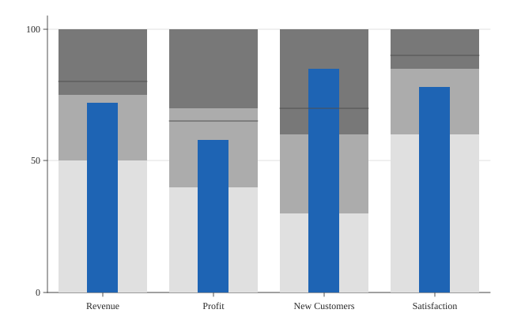

# Bullet

A bullet chart.



## Run it

```sh
mojo run -I . examples/bullet.mojo
```

(Or `pixi run example`, which runs every example in this directory in one go.)

## Source

```mojo
"""Demo: a bullet chart -- Mark.BULLET, Stephen Few's measure-vs-target-
against-qualitative-ranges composite, one per category
(Plot.encode_bullet(), a category plus a measure, a target, and a whole
*list* of ascending range thresholds -- see that method's own
docstring). Each category draws shaded background range bands (a small
grayscale ColorScale, lightest to darkest by range index -- see Theme's
own docstring for bullet_range_color_light/dark), a narrower measure
bar (mark_color, deliberately never colored by sign -- see
_render_bullet's own docstring for why, unlike Mark.CANDLESTICK/
WATERFALL), and a target tick (axis_color, full band width, matching
Mark.BOX's own median-line convention).

Four KPIs on a quarterly dashboard -- a realistic mix of "beat target"
(New Customers) and "missed target" (Revenue, Profit, Satisfaction),
the kind of at-a-glance comparison a bullet chart is for: not just
"how big is the number" (a bar chart's job), but "how does it compare
to both a specific goal and a qualitative sense of poor/satisfactory/
good."

Writes both a raster (.bmp, 3x supersampled) and a vector (.svg) file
from the same data -- see examples/donut.mojo's own docstring for why
every new chart-type example does this from here on.

Run with:
    pixi run example
"""

from canvas_mojo.color import Color
from canvas_mojo.buffer import Canvas
from canvas_mojo.io.bmp import write_bmp
from canvas_mojo.resize import downsample
from canvas_mojo.vector.svg import SvgCanvas, write_svg
from dataviz_mojo.plot import Plot, render, render_svg
from dataviz_mojo.theme import Theme

comptime _SUPERSAMPLE = 3


def main() raises:
    var kpis: List[String] = ["Revenue", "Profit", "New Customers", "Satisfaction"]
    var measures: List[Float64] = [72.0, 58.0, 85.0, 78.0]
    var targets: List[Float64] = [80.0, 65.0, 70.0, 90.0]
    var ranges: List[List[Float64]] = [
        [50.0, 75.0, 100.0],
        [40.0, 70.0, 100.0],
        [30.0, 60.0, 100.0],
        [60.0, 85.0, 100.0],
    ]

    var c = Canvas(640 * _SUPERSAMPLE, 420 * _SUPERSAMPLE, Color(255, 255, 255))
    var raster_plot = Plot().mark_bullet().encode_bullet(kpis, measures, targets, ranges).theme(
        Theme(scale=Float64(_SUPERSAMPLE))
    )
    render(c, raster_plot)
    var out = downsample(c, _SUPERSAMPLE)
    write_bmp(out, "examples/out_bullet.bmp")

    var svg = SvgCanvas(640, 420)
    var svg_plot = Plot().mark_bullet().encode_bullet(kpis, measures, targets, ranges).theme(Theme())
    render_svg(svg, svg_plot)
    write_svg(svg, "examples/out_bullet.svg")

    print("wrote examples/out_bullet.bmp and out_bullet.svg")
```

[View `bullet.mojo` on GitHub](https://github.com/randyzwitch/dataviz_mojo/blob/main/examples/bullet.mojo)
