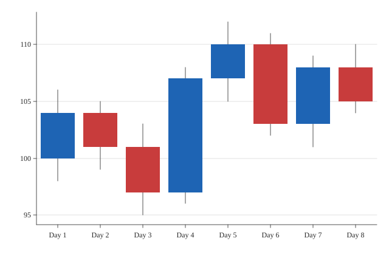

# Candlestick

A candlestick chart.



## Run it

```sh
mojo run -I . examples/candlestick.mojo
```

(Or `pixi run example`, which runs every example in this directory in one go.)

## Source

```mojo
"""Demo: a candlestick chart -- Mark.CANDLESTICK, one open/high/low/
close bar per category (Plot.encode_candlestick(), a category plus
*four* values -- see that method's own docstring). Each category draws
a thin high-low wick (axis_color) plus an open-close body, colored by
whether it closed up (mark_color) or down (mark_color_negative) --
unconditional sign coloring, the same "not gated behind an opt-in
flag" reasoning Mark.WATERFALL's own docstring gives (see Theme's own
docstring for both). Unlike Mark.BAR/LOLLIPOP/WATERFALL, the y-axis
doesn't force in a zero baseline -- the same reasoning Mark.BOX already
established: a candlestick chart's whole point is showing fine detail
in a price range nowhere near zero, so forcing zero into view would
flatten exactly the detail the chart exists to show.

Eight trading days of a single (fictional) stock -- a realistic mix of
up and down days, including one wide-range day (Day 4) and one narrow-
range day (Day 8), the kind of variety that actually exercises both
wick lengths and both body colors.

Writes both a raster (.bmp, 3x supersampled) and a vector (.svg) file
from the same data -- see examples/donut.mojo's own docstring for why
every new chart-type example does this from here on.

Run with:
    pixi run example
"""

from canvas_mojo.color import Color
from canvas_mojo.buffer import Canvas
from canvas_mojo.io.bmp import write_bmp
from canvas_mojo.resize import downsample
from canvas_mojo.vector.svg import SvgCanvas, write_svg
from dataviz_mojo.plot import Plot, render, render_svg
from dataviz_mojo.theme import Theme

comptime _SUPERSAMPLE = 3


def main() raises:
    var days: List[String] = [
        "Day 1", "Day 2", "Day 3", "Day 4", "Day 5", "Day 6", "Day 7", "Day 8",
    ]
    var open: List[Float64] = [100.0, 104.0, 101.0, 97.0, 107.0, 110.0, 103.0, 108.0]
    var high: List[Float64] = [106.0, 105.0, 103.0, 108.0, 112.0, 111.0, 109.0, 110.0]
    var low: List[Float64] = [98.0, 99.0, 95.0, 96.0, 105.0, 102.0, 101.0, 104.0]
    var close: List[Float64] = [104.0, 101.0, 97.0, 107.0, 110.0, 103.0, 108.0, 105.0]

    var c = Canvas(640 * _SUPERSAMPLE, 420 * _SUPERSAMPLE, Color(255, 255, 255))
    var raster_plot = Plot().mark_candlestick().encode_candlestick(days, open, high, low, close).theme(
        Theme(scale=Float64(_SUPERSAMPLE))
    )
    render(c, raster_plot)
    var out = downsample(c, _SUPERSAMPLE)
    write_bmp(out, "examples/out_candlestick.bmp")

    var svg = SvgCanvas(640, 420)
    var svg_plot = Plot().mark_candlestick().encode_candlestick(days, open, high, low, close).theme(Theme())
    render_svg(svg, svg_plot)
    write_svg(svg, "examples/out_candlestick.svg")

    print("wrote examples/out_candlestick.bmp and out_candlestick.svg")
```

[View `candlestick.mojo` on GitHub](https://github.com/randyzwitch/dataviz_mojo/blob/main/examples/candlestick.mojo)
