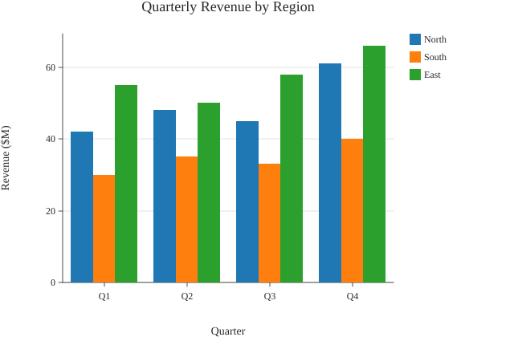

# Grouped Bar

A grouped bar chart.



## Run it

```sh
mojo run -I . examples/grouped_bar.mojo
```

(Or `pixi run example`, which runs every example in this directory in one go.)

## Source

```mojo
"""Demo: a grouped bar chart -- Mark.GROUPED_BAR, several bars side by
side per category instead of one (Plot().mark_grouped_bar().encode_
grouped_bar(categories, series_names, values); see that method's own
docstring for the values[series][category] data shape). Quarterly
revenue for three regions across four quarters -- the categorical
x-axis and zero-baseline y-axis are exactly Mark.BAR's own, shared via
_draw_categorical_axis_frame; what's new is each category's own band
splitting into one sub-bar per series (default_categorical_palette(),
the same cycling convention Mark.POINT's categorical color encoding and
Mark.ARC's own wedge coloring already use) plus a legend, reserved via
Theme.show_legend the same way Mark.POINT's own categorical-color
legend is.

Writes both a raster (.bmp, 3x supersampled) and a vector (.svg) file
from the same data -- see examples/donut.mojo's own docstring for why
every new example does this from here on.

Run with:
    pixi run example
"""

from canvas_mojo.color import Color
from canvas_mojo.buffer import Canvas
from canvas_mojo.io.bmp import write_bmp
from canvas_mojo.resize import downsample
from canvas_mojo.vector.svg import SvgCanvas, write_svg
from dataviz_mojo.plot import Plot, render, render_svg
from dataviz_mojo.theme import Theme

comptime _SUPERSAMPLE = 3


def main() raises:
    var quarters: List[String] = ["Q1", "Q2", "Q3", "Q4"]
    var series_names: List[String] = ["North", "South", "East"]
    var values: List[List[Float64]] = [
        [42.0, 48.0, 45.0, 61.0],
        [30.0, 35.0, 33.0, 40.0],
        [55.0, 50.0, 58.0, 66.0],
    ]

    var c = Canvas(640 * _SUPERSAMPLE, 420 * _SUPERSAMPLE, Color(255, 255, 255))
    var raster_plot = (
        Plot()
        .mark_grouped_bar()
        .encode_grouped_bar(quarters, series_names, values)
        .labels(title="Quarterly Revenue by Region", x_title="Quarter", y_title="Revenue ($M)")
        .theme(Theme(scale=Float64(_SUPERSAMPLE)))
    )
    render(c, raster_plot)
    var out = downsample(c, _SUPERSAMPLE)
    write_bmp(out, "examples/out_grouped_bar.bmp")

    var svg = SvgCanvas(640, 420)
    var svg_plot = (
        Plot()
        .mark_grouped_bar()
        .encode_grouped_bar(quarters, series_names, values)
        .labels(title="Quarterly Revenue by Region", x_title="Quarter", y_title="Revenue ($M)")
        .theme(Theme())
    )
    render_svg(svg, svg_plot)
    write_svg(svg, "examples/out_grouped_bar.svg")

    print("wrote examples/out_grouped_bar.bmp and out_grouped_bar.svg")
```

[View `grouped_bar.mojo` on GitHub](https://github.com/randyzwitch/dataviz_mojo/blob/main/examples/grouped_bar.mojo)
