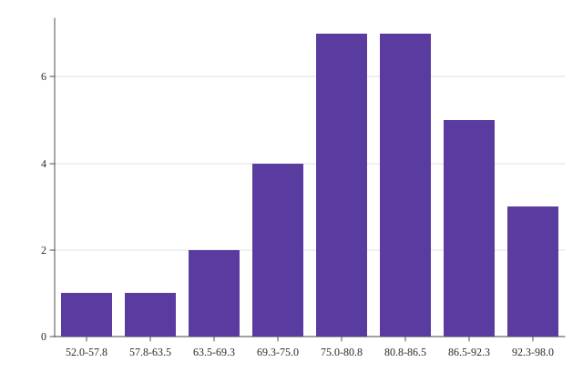

# Histogram

A histogram.



## Run it

```sh
mojo run -I . examples/histogram.mojo
```

(Or `pixi run example`, which runs every example in this directory in one go.)

## Source

```mojo
"""Demo: a histogram -- Plot.encode_histogram() bins continuous data
into equal-width intervals and maps the result onto Mark.BAR's own
categorical x-axis (bin range labels) / continuous y-axis (counts)
shape -- the same render path examples/bar.mojo's own bar chart uses,
just fed computed categories instead of given ones (see plot.mojo's
own encode_histogram() docstring).

Writes both a raster (.bmp, 3x supersampled) and a vector (.svg) file
from the same data -- see examples/donut.mojo's own docstring for why
every new chart-type example does this from here on.

Run with:
    pixi run example
"""

from canvas_mojo.color import Color
from canvas_mojo.buffer import Canvas
from canvas_mojo.io.bmp import write_bmp
from canvas_mojo.resize import downsample
from canvas_mojo.vector.svg import SvgCanvas, write_svg
from dataviz_mojo.plot import Plot, render, render_svg
from dataviz_mojo.theme import Theme

comptime _SUPERSAMPLE = 3


def main() raises:
    # Exam scores out of 100 -- a real bell-ish spread, not a uniform
    # or already-sorted list, so the binning has genuine work to do.
    var scores: List[Float64] = [
        52.0, 61.0, 65.0, 68.0, 70.0, 71.0, 72.0, 74.0, 75.0, 76.0,
        77.0, 78.0, 78.0, 79.0, 80.0, 81.0, 81.0, 82.0, 83.0, 84.0,
        85.0, 86.0, 87.0, 88.0, 89.0, 90.0, 91.0, 93.0, 95.0, 98.0,
    ]

    var c = Canvas(640 * _SUPERSAMPLE, 420 * _SUPERSAMPLE, Color(255, 255, 255))
    var raster_theme = Theme(mark_color=Color(90, 60, 160), scale=Float64(_SUPERSAMPLE))
    var raster_plot = Plot().mark_bar().encode_histogram(scores, bins=8).theme(raster_theme)
    render(c, raster_plot)
    var out = downsample(c, _SUPERSAMPLE)
    write_bmp(out, "examples/out_histogram.bmp")

    var svg = SvgCanvas(640, 420)
    var svg_plot = Plot().mark_bar().encode_histogram(scores, bins=8).theme(
        Theme(mark_color=Color(90, 60, 160))
    )
    render_svg(svg, svg_plot)
    write_svg(svg, "examples/out_histogram.svg")

    print("wrote examples/out_histogram.bmp and out_histogram.svg")
```

[View `histogram.mojo` on GitHub](https://github.com/randyzwitch/dataviz_mojo/blob/main/examples/histogram.mojo)
