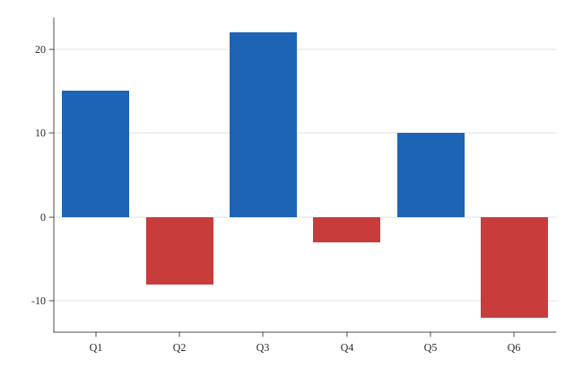

# Diverging Bar

A diverging bar chart.



## Run it

```sh
mojo run -I . examples/diverging_bar.mojo
```

(Or `pixi run example`, which runs every example in this directory in one go.)

## Source

```mojo
"""Demo: a diverging bar chart -- Mark.BAR with Theme.color_by_sign
set, coloring each bar by whether its own value is negative
(mark_color_negative) or not (mark_color) -- bars extending below the
zero baseline for negative values already works with no changes
needed (see examples/bar.mojo's own negative-value bar); color_by_sign
is the one further thing a genuinely *diverging* bar chart adds, so
the sign reads at a glance, not just from which direction the bar
points.

Writes both a raster (.bmp, 3x supersampled) and a vector (.svg) file
from the same data -- see examples/donut.mojo's own docstring for why
every new chart-type example does this from here on.

Run with:
    pixi run example
"""

from canvas_mojo.color import Color
from canvas_mojo.buffer import Canvas
from canvas_mojo.io.bmp import write_bmp
from canvas_mojo.resize import downsample
from canvas_mojo.vector.svg import SvgCanvas, write_svg
from dataviz_mojo.plot import Plot, render, render_svg
from dataviz_mojo.theme import Theme

comptime _SUPERSAMPLE = 3


def main() raises:
    var quarters: List[String] = ["Q1", "Q2", "Q3", "Q4", "Q5", "Q6"]
    var net_change: List[Float64] = [15.0, -8.0, 22.0, -3.0, 10.0, -12.0]

    var c = Canvas(640 * _SUPERSAMPLE, 420 * _SUPERSAMPLE, Color(255, 255, 255))
    var raster_theme = Theme(color_by_sign=True, scale=Float64(_SUPERSAMPLE))
    var raster_plot = Plot().mark_bar().encode_categorical(x=quarters, y=net_change).theme(
        raster_theme
    )
    render(c, raster_plot)
    var out = downsample(c, _SUPERSAMPLE)
    write_bmp(out, "examples/out_diverging_bar.bmp")

    var svg = SvgCanvas(640, 420)
    var svg_plot = Plot().mark_bar().encode_categorical(x=quarters, y=net_change).theme(
        Theme(color_by_sign=True)
    )
    render_svg(svg, svg_plot)
    write_svg(svg, "examples/out_diverging_bar.svg")

    print("wrote examples/out_diverging_bar.bmp and out_diverging_bar.svg")
```

[View `diverging_bar.mojo` on GitHub](https://github.com/randyzwitch/dataviz_mojo/blob/main/examples/diverging_bar.mojo)