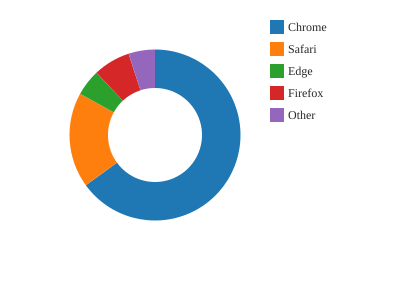

# Donut

A donut chart.



## Run it

```sh
mojo run -I . examples/donut.mojo
```

(Or `pixi run example`, which runs every example in this directory in one go.)

## Source

```mojo
"""Demo: a donut chart -- Mark.ARC with Theme.donut_inner_radius_
fraction set, the same browser-share data examples/pie.mojo draws,
switched from a full wedge to a ring segment (canvas_mojo.primitives.
fill_ring_sector_aa on the raster path, SvgCanvas.fill_ring_sector_aa
on the vector one -- see plot.mojo's own _render_arc docstring for
where that switch happens).

Writes both a raster (.bmp, 3x supersampled -- see examples/
scatter.mojo's own docstring for why) and a vector (.svg) file from
the same Plot, the pattern every new chart-type example uses from here
on rather than a separate file per backend -- both backends are
first-class (see the wiki), so both get exercised by every
example without doubling the file count.

Run with:
    pixi run example
"""

from canvas_mojo.color import Color
from canvas_mojo.buffer import Canvas
from canvas_mojo.io.bmp import write_bmp
from canvas_mojo.resize import downsample
from canvas_mojo.vector.svg import SvgCanvas, write_svg
from dataviz_mojo.plot import Plot, render, render_svg
from dataviz_mojo.theme import Theme

comptime _SUPERSAMPLE = 3


def main() raises:
    var browsers: List[String] = ["Chrome", "Safari", "Edge", "Firefox", "Other"]
    var share: List[Float64] = [65.0, 18.0, 5.0, 7.0, 5.0]

    var c = Canvas(400 * _SUPERSAMPLE, 300 * _SUPERSAMPLE, Color(255, 255, 255))
    var raster_plot = Plot().mark_arc().encode_categorical(x=browsers, y=share).theme(
        Theme(scale=Float64(_SUPERSAMPLE), donut_inner_radius_fraction=0.55)
    )
    render(c, raster_plot)
    var out = downsample(c, _SUPERSAMPLE)
    write_bmp(out, "examples/out_donut.bmp")

    var svg = SvgCanvas(400, 300)
    var svg_plot = Plot().mark_arc().encode_categorical(x=browsers, y=share).theme(
        Theme(donut_inner_radius_fraction=0.55)
    )
    render_svg(svg, svg_plot)
    write_svg(svg, "examples/out_donut.svg")

    print("wrote examples/out_donut.bmp and out_donut.svg")
```

[View `donut.mojo` on GitHub](https://github.com/randyzwitch/dataviz_mojo/blob/main/examples/donut.mojo)