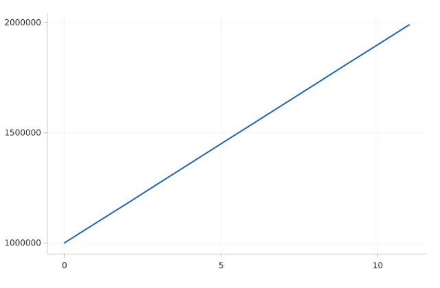

# Dynamic Left Margin

A line chart with large y-values.



## Run it

```sh
mojo run -I . examples/dynamic_margin.mojo
```

(Or `pixi run example`, which runs every example in this directory in one go.)

## Source

```mojo
"""Demo: a line chart with large y-values -- the y-axis tick labels
("1000000", "1500000", ...) are wide enough that Theme's default 60px
left margin would clip or crowd them. render() sizes the left margin
to actually fit the widest label (Theme.margin_left is treated as a
minimum, not the final value) with no extra configuration needed --
and that measurement is scale-aware too (Theme.scale=3.0 here, see
examples/scatter.mojo's own docstring for why every example here now
supersamples 3x): the margin fits the label's own 3x font size, not
the 1x one, before the whole thing gets downsampled back to its
target dimensions.

Run with:
    pixi run example
"""

from canvas_mojo.color import Color
from canvas_mojo.buffer import Canvas
from canvas_mojo.io.bmp import write_bmp
from canvas_mojo.io.png import write_png
from canvas_mojo.resize import downsample
from dataviz_mojo.plot import Plot, render
from dataviz_mojo.theme import Theme

comptime _SUPERSAMPLE = 3


def main() raises:
    var x = List[Float64]()
    var y = List[Float64]()
    for i in range(12):
        x.append(Float64(i))
        y.append(1_000_000.0 + Float64(i) * 90_000.0)

    var c = Canvas(640 * _SUPERSAMPLE, 420 * _SUPERSAMPLE, Color(255, 255, 255))
    var plot = Plot().mark_line().encode(x=x, y=y).theme(Theme(scale=Float64(_SUPERSAMPLE)))
    render(c, plot)
    var out = downsample(c, _SUPERSAMPLE)

    write_bmp(out, "examples/out_dynamic_margin.bmp")
    write_png(out, "examples/out_dynamic_margin.png")
    print("wrote examples/out_dynamic_margin.bmp and .png")
```

[View `dynamic_margin.mojo` on GitHub](https://github.com/randyzwitch/dataviz_mojo/blob/main/examples/dynamic_margin.mojo)