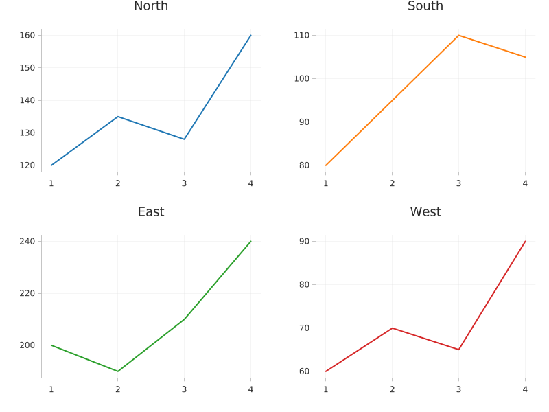

# Facets

Facets / small multiples.



## Run it

```sh
mojo run -I . examples/facets.mojo
```

(Or `pixi run example`, which runs every example in this directory in one go.)

## Source

```mojo
"""Demo: facets / small multiples -- one independently-laid-out Plot
per region, arranged in a shared grid via render_facets() rather than
one render() call per canvas. Four regions' quarterly revenue, each
its own line chart with its own axes, its own color (so it's visually
obvious where one plot ends and the next begins), and now its own
Plot.labels() title too -- render_facets()'s own per-cell title
support (the wiki's Changelog, its own "Plot.labels() reaches
render_facets/render_layers" entry): each region's own name
captions its own cell, using that cell's own inner plot rect, not one
shared title for the whole grid (see render_facets's own docstring for
why a per-cell title is the reading that makes sense here, unlike
render_layers's own shared one -- see examples/layers.mojo). Sharing
one 800x600 canvas in a 2x2 grid (cols=2) -- 400x300 per cell.

Supersampled 3x -- see examples/scatter.mojo's own docstring for why
every example here now renders this way (and why it isn't just "a
bigger canvas"). render_facets() itself runs at 3x (a 2400x1800
canvas, each plot's own Theme.scale=3.0); downsample() then shrinks
the *entire* canvas back down to 800x600 in one call, after every
cell has been drawn -- downsample() is a plain per-pixel box filter,
with no idea cells exist, so it treats a multi-cell facet canvas
exactly the same as any single-plot one.

Run with:
    pixi run example
"""

from canvas_mojo.color import Color
from canvas_mojo.buffer import Canvas
from canvas_mojo.io.bmp import write_bmp
from canvas_mojo.io.png import write_png
from canvas_mojo.resize import downsample
from dataviz_mojo.color_scale import default_categorical_palette
from dataviz_mojo.plot import Plot, render_facets
from dataviz_mojo.theme import Theme

comptime _SUPERSAMPLE = 3


def main() raises:
    var quarters: List[Float64] = [1.0, 2.0, 3.0, 4.0]
    var north: List[Float64] = [120.0, 135.0, 128.0, 160.0]
    var south: List[Float64] = [80.0, 95.0, 110.0, 105.0]
    var east: List[Float64] = [200.0, 190.0, 210.0, 240.0]
    var west: List[Float64] = [60.0, 70.0, 65.0, 90.0]

    var palette = default_categorical_palette()
    var s = Float64(_SUPERSAMPLE)
    var plots = List[Plot]()
    plots.append(
        Plot().mark_line().encode(x=quarters, y=north).labels(title="North").theme(
            Theme(mark_color=palette[0], scale=s)
        )
    )
    plots.append(
        Plot().mark_line().encode(x=quarters, y=south).labels(title="South").theme(
            Theme(mark_color=palette[1], scale=s)
        )
    )
    plots.append(
        Plot().mark_line().encode(x=quarters, y=east).labels(title="East").theme(
            Theme(mark_color=palette[2], scale=s)
        )
    )
    plots.append(
        Plot().mark_line().encode(x=quarters, y=west).labels(title="West").theme(
            Theme(mark_color=palette[3], scale=s)
        )
    )

    var c = Canvas(800 * _SUPERSAMPLE, 600 * _SUPERSAMPLE, Color(255, 255, 255))
    render_facets(c, plots, cols=2)
    var out = downsample(c, _SUPERSAMPLE)

    write_bmp(out, "examples/out_facets.bmp")
    write_png(out, "examples/out_facets.png")
    print("wrote examples/out_facets.bmp and .png")
```

[View `facets.mojo` on GitHub](https://github.com/randyzwitch/dataviz_mojo/blob/main/examples/facets.mojo)