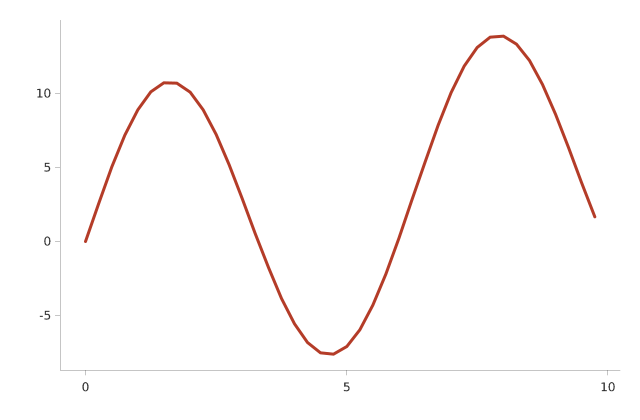

# Line

A basic line plot.



## Run it

```sh
mojo run -I . examples/line.mojo
```

(Or `pixi run example`, which runs every example in this directory in one go.)

## Source

```mojo
"""Demo: a basic line plot -- Mark.LINE, a custom Theme (different
mark color, thicker line, gridlines off) to show that's actually
wired through render(), not just the default look.

Supersampled 3x -- see examples/scatter.mojo's own docstring for why
every example here now renders this way (and why it isn't just "a
bigger canvas").

Run with:
    pixi run example
"""

from std.math import sin

from canvas_mojo.color import Color
from canvas_mojo.buffer import Canvas
from canvas_mojo.io.bmp import write_bmp
from canvas_mojo.io.png import write_png
from canvas_mojo.resize import downsample
from dataviz_mojo.plot import Plot, render
from dataviz_mojo.theme import Theme

comptime _SUPERSAMPLE = 3


def main() raises:
    var x = List[Float64]()
    var y = List[Float64]()
    for i in range(40):
        var t = Float64(i) * 0.25
        x.append(t)
        y.append(sin(t) * 10.0 + t * 0.5)

    var c = Canvas(640 * _SUPERSAMPLE, 420 * _SUPERSAMPLE, Color(255, 255, 255))
    var custom_theme = Theme(
        mark_color=Color(180, 60, 40),
        line_width=3.0,
        show_gridlines=False,
        scale=Float64(_SUPERSAMPLE),
    )
    var plot = Plot().mark_line().encode(x=x, y=y).theme(custom_theme)
    render(c, plot)
    var out = downsample(c, _SUPERSAMPLE)

    write_bmp(out, "examples/out_line.bmp")
    write_png(out, "examples/out_line.png")
    print("wrote examples/out_line.bmp and .png")
```

[View `line.mojo` on GitHub](https://github.com/randyzwitch/dataviz_mojo/blob/main/examples/line.mojo)