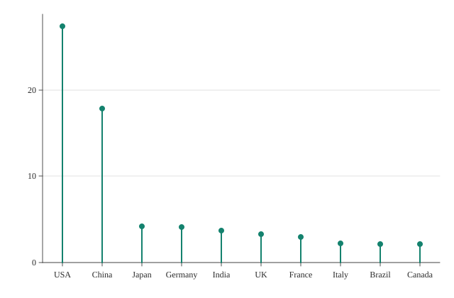

# Lollipop

A lollipop chart.



## Run it

```sh
mojo run -I . examples/lollipop.mojo
```

(Or `pixi run example`, which runs every example in this directory in one go.)

## Source

```mojo
"""Demo: a lollipop chart -- Mark.LOLLIPOP, exactly Mark.BAR's own
categorical x-axis / zero-baseline y-axis (encode_categorical(), the
identical data shape a bar chart uses -- see plot.mojo's own
mark_lollipop() docstring), but each category draws a thin stem plus a
point at its own value instead of a filled rect. A lollipop chart
reads well when there are enough categories that a full bar's own
width would start to feel heavy -- shown here with ten, more than any
other categorical example so far in this package.

Writes both a raster (.bmp, 3x supersampled) and a vector (.svg) file
from the same data -- see examples/donut.mojo's own docstring for why
every new chart-type example does this from here on.

Run with:
    pixi run example
"""

from canvas_mojo.color import Color
from canvas_mojo.buffer import Canvas
from canvas_mojo.io.bmp import write_bmp
from canvas_mojo.resize import downsample
from canvas_mojo.vector.svg import SvgCanvas, write_svg
from dataviz_mojo.plot import Plot, render, render_svg
from dataviz_mojo.theme import Theme

comptime _SUPERSAMPLE = 3


def main() raises:
    var countries: List[String] = [
        "USA", "China", "Japan", "Germany", "India",
        "UK", "France", "Italy", "Brazil", "Canada",
    ]
    var gdp: List[Float64] = [27.4, 17.8, 4.2, 4.1, 3.7, 3.3, 3.0, 2.2, 2.1, 2.1]

    var c = Canvas(640 * _SUPERSAMPLE, 420 * _SUPERSAMPLE, Color(255, 255, 255))
    var raster_theme = Theme(mark_color=Color(20, 130, 110), scale=Float64(_SUPERSAMPLE))
    var raster_plot = Plot().mark_lollipop().encode_categorical(x=countries, y=gdp).theme(raster_theme)
    render(c, raster_plot)
    var out = downsample(c, _SUPERSAMPLE)
    write_bmp(out, "examples/out_lollipop.bmp")

    var svg = SvgCanvas(640, 420)
    var svg_plot = Plot().mark_lollipop().encode_categorical(x=countries, y=gdp).theme(
        Theme(mark_color=Color(20, 130, 110))
    )
    render_svg(svg, svg_plot)
    write_svg(svg, "examples/out_lollipop.svg")

    print("wrote examples/out_lollipop.bmp and out_lollipop.svg")
```

[View `lollipop.mojo` on GitHub](https://github.com/randyzwitch/dataviz_mojo/blob/main/examples/lollipop.mojo)