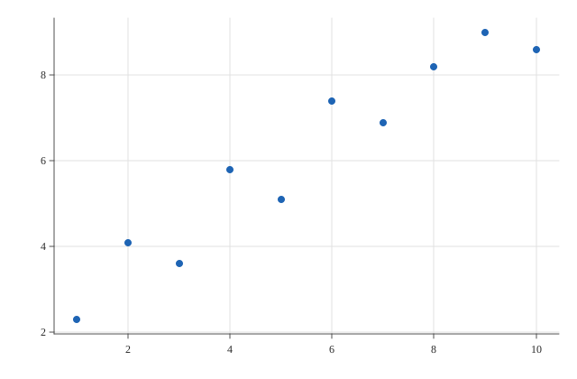

<div class="hx:mt-6 hx:mb-6">

  Grammar-of-graphics charts,&nbsp;<br class="hx:sm:block hx:hidden" />native to Mojo

</div>

<div class="hx:mb-12">

  One fluent `Plot` builder -- mark, encode, theme -- covers 40+ chart types,<br class="hx:sm:block hx:hidden" />
  rendered to SVG or raster.

</div>

<div class="hx:mb-12 hx:flex hx:flex-wrap hx:gap-4">


</div>

## See it before you build it

Every chart below comes straight from the example gallery.

<style>
/* The rest of this page leans on Hextra's own shortcodes, whose
   classes are guaranteed to exist in its shipped, PRE-compiled
   Tailwind bundle (docs/site's Hugo build doesn't run a Tailwind/
   PostCSS step of its own -- there's no JIT scan of this project's
   own content, so a hand-typed `hx:`-prefixed class with no matching
   rule in that bundle just does nothing, silently). This gallery is
   hand-rolled HTML instead of a shortcode, so it gets its own real,
   plain CSS here rather than guessing at Tailwind utilities that may
   or may not have made it into that bundle.

   Section H2s need the same treatment for a different reason: Hextra's
   own H2 styling (semibold, tracking-tight, text-3xl, border-b) lives
   in typography.css scoped under `.content h2` -- applied by the
   normal docs single/list page templates, which wrap `.Content` in a
   `content` div. `layout: hextra-home` doesn't use that template (see
   hextra-home.html), so this page's H2s render with zero styling from
   the theme -- plain browser defaults, indistinguishable from bold
   paragraph text. This mirrors that same rule in plain CSS rather
   than trying to force a `.content` wrapper onto a layout that
   deliberately doesn't have one. The same gap hits the plain paragraphs
   that follow each H2/code block ("Every chart below...", "That's the
   same pattern...") -- Tailwind's preflight reset zeroes default <p>
   margins, and there's no `.content p { mt-6 }` prose rule to put it
   back on this layout either. Scoped to `p:not([class])` so it only
   catches those plain markdown paragraphs, not the hero/gallery-caption
   <p>s above, which already carry their own deliberate spacing. */
h2 {
  margin-top: 2.5rem;
  margin-bottom: 1rem;
  padding-bottom: 0.25rem;
  border-bottom: 1px solid color-mix(in srgb, currentColor 12%, transparent);
  font-size: 1.875rem;
  line-height: 2.25rem;
  font-weight: 600;
  letter-spacing: -0.025em;
}
p:not([class]) {
  margin-top: 1rem;
  line-height: 1.75rem;
}
/* Same story again: Tailwind's preflight resets <a> to
   `color: inherit; text-decoration: inherit`, and it's `.content a`
   (text-primary-600, underlined) that normally undoes that -- missing
   here for the same reason as h2/p above. Hextra's own shortcodes
   (hero-button, feature-card, ...) already mark their own custom-
   styled links `not-prose` to opt out of that prose rule, so this
   reuses that exact convention instead of inventing a new one: plain
   inline links (the "examples gallery" link, "Quickstart"/"Examples"
   at the bottom) get real link styling, the gallery cards below (also
   marked not-prose, since a card-wrapper link shouldn't look like
   inline text) are left alone. --hx-color-primary-600 is a plain CSS
   custom property set in `:root`, not a Tailwind utility class, so
   -- unlike an `hx:`-prefixed class -- it's guaranteed to exist in
   the shipped CSS regardless of what got compiled in, and it's the
   same accent color the hero buttons already use. Scoped to `#content`
   (the hextra-home layout's own main-content id) so it only touches
   links inside the page body -- unscoped, it was also repainting the
   site header's "dataviz_mojo" title link and top-nav "GitHub" link
   blue, since those are plain <a>s too and live outside any
   not-prose-marked element. */
#content a:not(.not-prose) {
  color: var(--hx-color-primary-600);
  text-decoration: underline;
  text-decoration-color: color-mix(in srgb, var(--hx-color-primary-600) 40%, transparent);
  text-underline-offset: 2px;
}
#content a:not(.not-prose):hover {
  text-decoration-color: var(--hx-color-primary-600);
}
.dvm-gallery {
  display: grid;
  grid-template-columns: repeat(3, 1fr);
  gap: 1rem;
  width: 100%;
  margin: 1.5rem 0 3rem;
}
@media (max-width: 640px) {
  .dvm-gallery {
    grid-template-columns: repeat(2, 1fr);
  }
}
.dvm-gallery a {
  display: block;
  border-radius: 1rem;
  border: 1px solid color-mix(in srgb, currentColor 15%, transparent);
  overflow: hidden;
  text-decoration: none;
  color: inherit;
  transition: border-color 0.2s ease;
}
.dvm-gallery a:hover {
  border-color: color-mix(in srgb, currentColor 45%, transparent);
}
.dvm-gallery .dvm-thumb {
  background: #fff;
  height: 8rem;
  display: flex;
  align-items: center;
  justify-content: center;
  padding: 0.5rem;
}
.dvm-gallery .dvm-thumb img {
  max-width: 100%;
  max-height: 100%;
}
.dvm-gallery .dvm-caption {
  padding: 0.5rem 0.75rem;
  font-size: 0.875rem;
  opacity: 0.7;
}
/* "A first chart"'s code sample paired with the actual chart it
   produces, side by side -- half-width each on desktop, stacked on
   mobile. examples/out_scatter.svg is real pipeline output (`scatter(x,
   y)` is `Plot().mark_point().encode(x=x, y=y)` under the hood, same
   x/y as this snippet -- see plot.mojo's own `scatter()` docstring),
   not a hand-dropped image, so it can't drift out of sync with what
   the code on the left actually does. */
.dvm-chart-row {
  display: grid;
  grid-template-columns: 1fr 1fr;
  gap: 1.5rem;
  align-items: center;
  width: 100%;
  margin-top: 1rem;
}
@media (max-width: 640px) {
  .dvm-chart-row {
    grid-template-columns: 1fr;
  }
}
.dvm-chart-preview {
  background: #fff;
  border-radius: 0.75rem;
  border: 1px solid color-mix(in srgb, currentColor 15%, transparent);
  padding: 0.5rem;
  display: flex;
  align-items: center;
  justify-content: center;
}
.dvm-chart-preview img {
  max-width: 100%;
  height: auto;
  display: block;
}
/* A plain "keep going" pointer to Quickstart after the last section --
   not another hero-button pair (already at the top of the page, and
   this isn't a second call to action, just a way out for someone who
   read the whole pitch), right-aligned the way a "next page" link
   reads. not-prose so it skips the underline #content's link rule
   adds -- this already carries its own arrow and weight. */
.dvm-next {
  width: 100%;
  text-align: right;
  margin-top: 1.5rem;
}
.dvm-next a {
  font-size: 1.125rem;
  font-weight: 600;
  color: var(--hx-color-primary-600);
}
.dvm-next a:hover {
  text-decoration: underline;
}
</style>

<div class="dvm-gallery not-prose">
  <a href="examples/streamgraph/" class="not-prose"><div class="dvm-thumb"></div><div class="dvm-caption">Streamgraph</div></a>
  <a href="examples/chord/" class="not-prose"><div class="dvm-thumb"></div><div class="dvm-caption">Chord</div></a>
  <a href="examples/sunburst/" class="not-prose"><div class="dvm-thumb"></div><div class="dvm-caption">Sunburst</div></a>
  <a href="examples/candlestick/" class="not-prose"><div class="dvm-thumb"></div><div class="dvm-caption">Candlestick</div></a>
  <a href="examples/radar/" class="not-prose"><div class="dvm-thumb"></div><div class="dvm-caption">Radar</div></a>
  <a href="examples/sankey/" class="not-prose"><div class="dvm-thumb"></div><div class="dvm-caption">Sankey</div></a>
  <a href="examples/calendar_heatmap/" class="not-prose"><div class="dvm-thumb"></div><div class="dvm-caption">Calendar heatmap</div></a>
  <a href="examples/treemap/" class="not-prose"><div class="dvm-thumb"></div><div class="dvm-caption">Treemap</div></a>
  <a href="examples/population_pyramid/" class="not-prose"><div class="dvm-thumb"></div><div class="dvm-caption">Population pyramid</div></a>
</div>

<p class="hx:text-sm hx:text-gray-500 hx:dark:text-gray-400 hx:mb-12">
  Nine of the 40+ chart types this package builds -- see the rest, source next to rendered output, in
  <a href="examples/">the examples gallery</a>.
</p>

## Why dataviz_mojo?


  
  
  
  
  
  


## A first chart

<div class="dvm-chart-row">

<div class="dvm-chart-code">

```mojo
from dataviz_mojo import Plot, save

def main() raises:
    var x: List[Float64] = [1.0, 2.0, 3.0, 4.0, 5.0, 6.0, 7.0, 8.0, 9.0, 10.0]
    var y: List[Float64] = [2.3, 4.1, 3.6, 5.8, 5.1, 7.4, 6.9, 8.2, 9.0, 8.6]

    var plot = (
                Plot()
                .mark_point()
                .encode(x=x, y=y)
               )

    save(plot, "chart.svg")
```

</div>

<div class="dvm-chart-preview"></div>

</div>

That's the same pattern behind every mark type this package supports, plus color/size encoding, facets, multi-series layering, and the raster backend.

<p class="dvm-next"><a href="quickstart/" class="not-prose">Quickstart &rarr;</a></p>

